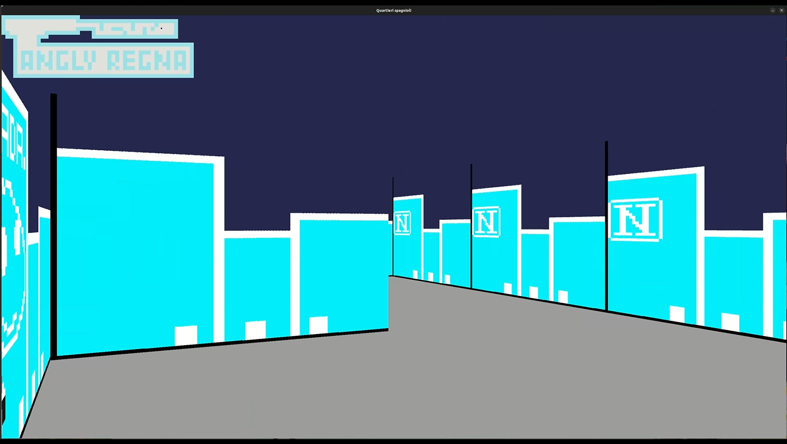

# 42 Project: cub3D

## Watch the Video
[](https://andreianghi.ddns.net/Assets/img/progetti/)

## Description
This project is developed in C using the MLX library on Linux Ubuntu.
It focuses on implementing a raycasting algorithm to create a 2.5D game.

## Getting Started
```
make test3
```

## Contact Me
- [Portfolio](https://andreianghi.ddns.net)
- [Linktree](https://socialandreianghi.ddns.net)

## Don't Forget to Give This Repo a ⭐